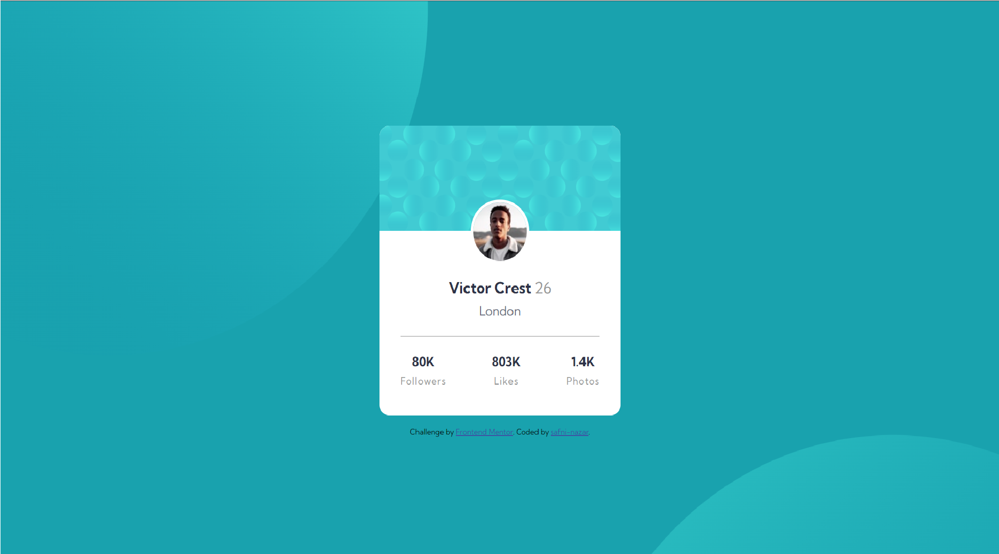

# Frontend Mentor - Profile card component solution

This is a solution to the [Profile card component challenge on Frontend Mentor](https://www.frontendmentor.io/challenges/profile-card-component-cfArpWshJ). Frontend Mentor challenges help you improve your coding skills by building realistic projects. 

### Screenshot

- Live Site URL: [Add live site URL here]()

### Built with

- Semantic HTML5 markup
- CSS custom properties
- Flexbox
- Desktop-first workflow

## Author

- Website - [Safni Nazar](https://linktr.ee/shafni50)
- Frontend Mentor - [@shafni50](https://www.frontendmentor.io/profile/shafni50)
